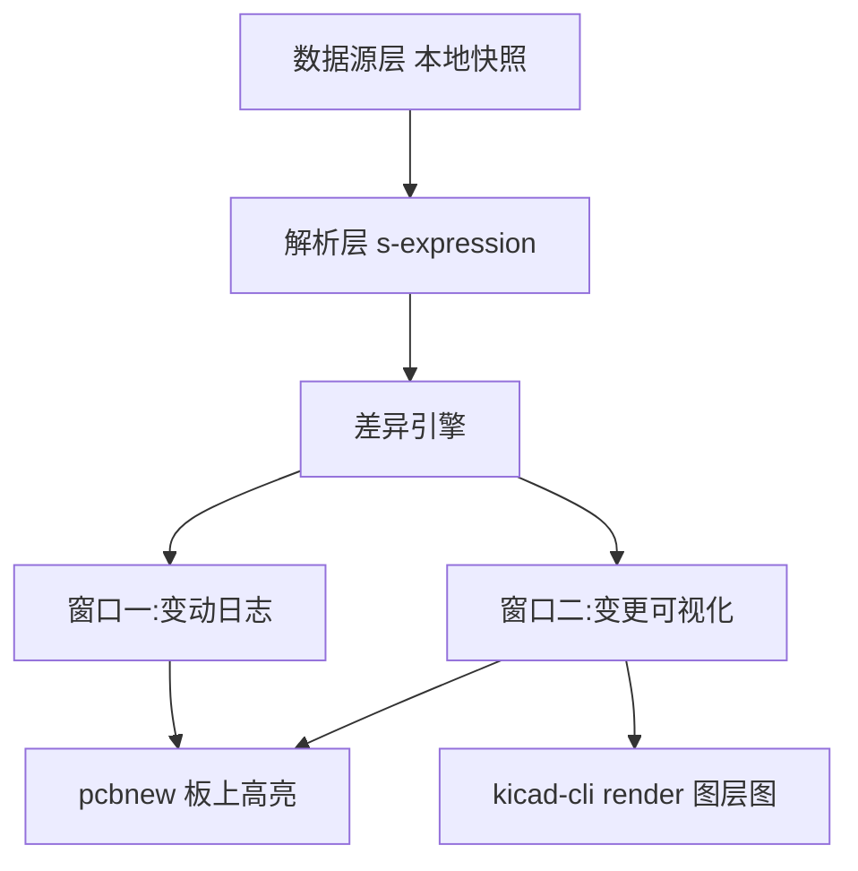

# KiCad 插件:项目操作日志与改动变更可视化

## 1. 目标

在 KiCad PCB 编辑器内提供**两个独立窗口**:

- **窗口一:变动日志窗口**(非模态,可边编辑边查看):
  - 按位号记录变更明细,如「X1 坐标变更 (11,23) → (111,2222)」
  - 变更类型:新增 / 删除 / 修改(坐标、旋转、层、封装、网络等属性级对比)
  - 列表 + 详情面板
- **窗口二:变更可视化窗口**(参照 DRC + 嘉立创 DFM 风格):
  - 左侧:按图层分组的变动列表,点击条目联动定位
  - 右侧:图层渲染图分层对比,三种模式:并排 / 红绿叠加 / 滑块分割
  - 渲染引擎:`kicad-cli pcb render`(官方渲染效果)
- **操作日志**:查看项目文件的变更历史(时间、版本、变更摘要)
- **变更可视化**:
  - 结构化差异列表(新增/删除/修改的封装、走线、过孔、区域、文本等)
  - 变更统计图表(按类型统计数量)
  - 在 PCB 画布上高亮差异元素

## 2. 总体架构



## 3. 模块划分

### 3.1 数据源层 —— 已确定:本地快照(方案 B)
- 在项目目录下维护 `snapshots/` 目录,保存 `.kicad_pcb` 的历史快照
- **自动记录**:用 `wx.FileSystemWatcher` 监听板文件变化,保存后自动生成快照(带防抖,避免重复)
- **手动记录**:插件提供「记录快照」按钮,可附备注
- 每个快照附带 `metadata.json`:时间、备注、文件 hash、顺序号
- 优点:无 Git 依赖、实现简单;管理上保留快照上限(可配置)

### 3.2 解析层
- 解析 `.kicad_pcb`(s-expression 格式),提取元素及唯一标识:
  - `footprint`(tstamp/uuid)、`net`、`track`、`via`、`zone`、
    `gr_text`、`gr_line`、`dimension`、`segment` 等
- 输出每类元素的规范化记录(标识 + 关键属性)

### 3.3 差异引擎
- **匹配策略**:先按位号(reference)匹配,位号不存在时回退 UUID 匹配
  - 替换元件会记录为一条「封装修改」,而非拆成删除+新增
- 输出:
  - `added`(新增)、`removed`(删除)、`modified`(修改,含属性级对比)
- 属性级对比:坐标、旋转、层、镜像、封装库 ID、网络、文本内容等
- 走线/过孔**逐条记录**(每条一条日志,含网络、层、起终点)
- 生成按类型聚合的统计结果

### 3.4 UI 层 —— 独立变动日志窗口(wxPython,随 KiCad 附带)
- **非模态窗口**(`wx.Frame`):可边画板边看,不阻塞编辑
- 布局:
  - **顶部**:历史版本时间线(选择要对比的两个快照)
  - **中部**:变更统计(封装 +3 / 走线 -12 …)与类型过滤
  - **列表**:逐条变动明细,列为「位号 | 变更类型 | 属性 | 变更前 → 变更后」
  - **详情面板**:点击某条后,下方展示该元素完整属性前后对比
- 底部按钮:
  - 「在板子上高亮」— 将差异元素高亮到当前 pcbnew 画布
  - 「记录快照(手动)」— 立即生成一条带备注的快照
  - 「刷新」— 手动刷新;同时监听快照目录变化自动刷新
- 坐标显示单位**跟随当前板子设置**(`GetUserUnits()`)

### 3.5 UI 层 —— 变更可视化窗口(参照 DRC + 嘉立创 DFM)
- **独立非模态窗口**,与变动日志窗口分开
- 布局:
  - **左侧**:变动列表,**按图层分组**(F.Cu / B.Cu / F.Silk / Edge.Cuts …),组内按位号排序;仅显示有变更的图层
  - **右侧**:图层渲染图对比区
    - 顶部:图层选项卡(仅有变更的图层)+ 对比模式切换
    - 三种对比模式:**并排对比**(左前右后)、**红绿叠加**(删除红/新增绿)、**滑块分割**(左右拖动)
- **渲染引擎**:`kicad-cli pcb render`
  - 后台线程异步渲染两个快照的图层图,带进度提示与缓存
  - 以两版板框并集为基准,固定 zoom/pan 参数渲染,保证像素级对齐(叠加模式的前提)
- **联动交互(DRC 式)**:
  - 点击左侧列表条目 → 右侧图层图画出标记并定位;同时真实板子画布缩放定位到该元素
  - 「仅显示差异」开关、图例(🟢新增 / 🔴删除 / 🟡修改)
- 底部按钮:「在板子上高亮」「导出对比图」「关闭」

### 3.6 板上高亮
- 通过 `pcbnew` API 定位差异元素并加入选择集 / 或生成临时图形层标记
- 提供一键清除高亮

## 4. 插件注册与配置

- **目标环境:KiCad 10**(内嵌 Python 与 wxPython Phoenix,开发时以其自带解释器为准;运行环境即 `pcbnew` 内嵌解释器)
- `ActionPlugin` 插件结构:
  ```
  plugin/
  ├── __init__.py          # 注册菜单项
  ├── main.py              # 入口
  ├── datasource/          # git / 快照
  ├── parser/              # s-expression 解析
  ├── diff/                # 差异引擎
  ├── ui/                  # wxPython 对话框
  └── settings.json        # 插件配置
  ```
- 安装到 `~/Documents/KiCad/<版本>/scripting/plugins/`
- 可配置项:自动快照开关、数据源选择、忽略项目录

## 5. 里程碑

| 阶段 | 内容 | 产出 |
|------|------|------|
| M1 | 插件骨架:可注册、弹出日志窗口 | 可加载的最小插件 |
| M2 | 快照数据层:FSW 自动快照 + 手动快照 + metadata | 版本列表 |
| M3 | 解析 + 差异引擎 | 结构化 diff |
| M4 | 日志窗口:时间线 + 统计 + 列表 + 详情面板 | 窗口一可用 |
| M5 | 可视化窗口:kicad-cli 图层渲染 + 三种对比模式 + 联动定位 | 窗口二可用 |
| M6 | 板上高亮与清除 | 可视化闭环 |
| M7 | 配置(快照上限、保存触发开关)、打包(PCM 兼容 zip) | 可分发包 |

## 6. 已确认决策

1. **变更数据来源:本地快照**(`snapshots/` 目录,无 Git 依赖)
2. **目标 KiCad 版本:KiCad 10**(以其内嵌 Python 解释器运行)
3. **可视化重点:两者都要** —— 对话框差异视图 + 板上高亮
4. **记录方式:自动(保存触发)+ 手动可选**,可通过配置切换
5. **变动日志窗口:独立非模态窗口**,列表 + 详情面板
6. **走线/过孔:逐条记录**(含网络、层、坐标)
7. **坐标单位:跟随板子显示设置**(mm / mil 自动切换)
8. **刷新:快照变化自动刷新 + 手动刷新按钮**
9. **窗口结构:两个独立窗口**(变动日志窗口 + 变更可视化窗口)
10. **可视化窗口样式:参照 DRC + 嘉立创 DFM**,左列表(按图层分组)、右图层图分层对比
11. **对比模式:三种都要**(并排 / 红绿叠加 / 滑块分割)
12. **图层范围:仅显示有变更的图层**
13. **渲染引擎:KiCad 10 改用 `kicad-cli pcb export svg --layers` + wx 光栅化**
    (KiCad 10 的 `pcb render` 已改为 3D 渲染、不再支持 `--layers`,实测确认)

## 7. 实现状态(已完成)

| 里程碑 | 状态 | 说明 |
|--------|------|------|
| M1 插件骨架 | ✅ | `kicad_change_log/` ActionPlugin 包,图标 PNG+SVG |
| M2 快照数据层 | ✅ | wx.Timer 轮询 + hash 去重 + 手动快照 + 上限裁剪 |
| M3 解析 + 差异引擎 | ✅ | 兼容 KiCad ≤9 nm 与 KiCad 10 mm 双格式;位号优先匹配 |
| M4 日志窗口 | ✅ | 时间线 + 统计 + 列表 + 详情面板 |
| M5 可视化窗口 | ✅ | SVG 管线 + 校准标记像素对齐 + 三种对比模式 + 联动定位 |
| M6 板上高亮 | ✅ | uuid 匹配选择集高亮 + FocusOnItem 定位(防御式 API 兼容) |
| M7 配置打包 | ✅ | `settings.json`、`install.py`、`build_pcm.py`(PCM zip) |

### 验证结果(实测)

- 纯标准库单测 27 项 + 快照/校准 12 项全部通过
- KiCad 10.0.3 自带 Python 端到端:UI 双窗口构建、7 条变更检出、
  3 图层渲染、仿射校准 12px/mm 零偏移、叠加对比图输出正常
- 关键实测发现(已写入代码):
  1. KiCad 10 板文件原生格式为 mm 浮点(`version 20260206`),旧格式为 nm;
  2. KiCad 10 `kicad-cli pcb render` 无 `--layers`,按层图须用 `export svg`;
  3. KiCad 10 `VECTOR2I` 仍为 32 位 nm,±2147mm 超限会溢出崩溃;
  4. `wx.BitmapBundle.FromSVGFile(path, size)` 光栅化含 alpha,可精确合成。
